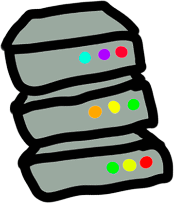

# Giancarl021

    

## Hello

My name is Giancarlo Luz, and I am a  **backend developer**. I work mainly with  and .

## About me

I am a Brazilian developer working with backend services, mainly APIs and simple tools and websites. Most of my repositories follows the **`start` &rarr; `end`** template, where I start a project with a clear end in sight, and I try to make it as simple as possible.

Most of my work experience is with the [Azure](https://azure.microsoft.com/) cloud provider, with a bit of [DigitalOcean](https://www.digitalocean.com/) and [AWS](https://aws.amazon.com/) seasoning.

## Socials

Feel free to contact me on any of these platforms:

<table align="center">
  <tr>
    <td>
        
    </td>
    <td>
        
    </td>
    <td>
        
    </td>
  </tr>
 </table>

## Certifications

I have some [Microsoft Certifications](https://learn.microsoft.com/en-us/certifications/), feel free to check it out:

<table align="center">
  <tr>
    <td>
        
    </td>
    <td>
        
    </td>
    <td>
        
    </td>
    <td>
        
    </td>
  </tr>
 </table>

## Feel free to check my pinned repositories below 👇
